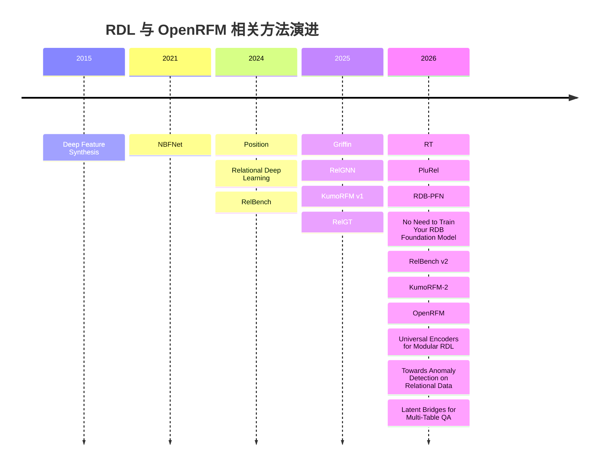
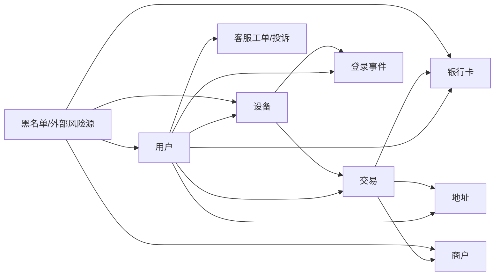

# OpenRFM 与多表关系数据基础模型研究报告

## 执行摘要

OpenRFM 是一篇非常重要、也非常“纠偏”的论文。它并不是简单再造一个更大的关系基础模型，而是先把当时最有代表性的开放关系基础模型路线拆开来看：**为什么 RT 这类模型看上去像“零样本”，其实本质上仍然依赖关系式 in-context learning；为什么仅靠关系邻域内的标签传播会在很多任务上失灵；以及为什么预训练数据分布，而不是仅仅“模型更大”，决定了模型最后是在“懒惰核回归”式工作，还是在真正学到有用特征。**在此基础上，OpenRFM 通过“继续预训练 RT 主干 + 增加批级 ICL 头 + 强化合成先验中的显式同配性控制”得到更稳定、更强的开放 RFM，在 24 个任务上的综合排名优于 RT，并在大批评测上超过商业 KumoRFM v1。citeturn1view0turn21view1turn40search2

如果把近两年的脉络压缩成一句话，那么可以说：**RDL 从“把多表数据库转成图，再训练一个专用 GNN”演进到了“把多表数据库当作一种可预训练的数据模态”，再继续向“合成数据驱动的通用关系基础模型”推进。**这条路线上，有三类方法最关键：第一类是 **扁平化/特征合成路线**，代表是 DFS、JUICE/fastDFS、RDBLearn；第二类是 **监督式图模型路线**，代表是 RelBench 的 RDL-GNN、NBFNet、RelGNN、RelGT、Griffin；第三类是 **关系基础模型路线**，代表是 KumoRFM、RT、PluRel、RDB-PFN、KumoRFM-2、OpenRFM。它们最大的分歧，不是“用不用 Transformer”这么表面，而是：**关系信号究竟是在特征工程阶段被“压扁”出来，还是在图消息传递中被“传播”出来，还是在预训练过程中被“内化”为先验”。**citeturn10view5turn33view0turn15search2turn24search2turn15search3turn13view0turn1view0

对金融风控而言，最务实的结论并不神秘。若你要在今天落地到真实多表风控库，**开源、可复现、工程风险最低**的起点仍然是两条：一条是 **JUICE/RDBLearn/DFS 这类“先关系特征化，再喂单表基础模型”** 的路线；另一条是 **RelGNN/RelGT 这类需要训练、但更像标准工业图学习栈** 的路线。前者部署快、成本可控、审计容易；后者在标签足够、图关系强、需要持续训练更新时更稳。OpenRFM 和 RT/PluRel 代表的是“开放 RFM 真正开始像回事”的方向，但截至 2026 年 6 月底，**OpenRFM 的公开可复现实验入口仍不如 RT、RelGT、RDB-PFN、RelBench 这些项目那样成熟清晰**，因此它更像“研究方向上的最佳公开证据”，而不是“开箱即用的首选生产方案”。citeturn21view1turn18view2turn20view0turn31view0turn33view0turn27view0

还有一个更重要的判断：**金融风控多表数据几乎天生适合 RDL/RFM。**因为风控信号很少只住在一张表里，它通常散落在用户、设备、交易、商户、收货地址、登录事件、工单、黑名单、文本备注等多张表之间。而 RDL/RFM 的价值正是：不再靠人工写大量 SQL join + window agg 去“猜”哪些关系有用，而是把多表结构本身作为可学习对象。RelBench 的提出、KumoRFM-2 在 41 个任务上的结果、OpenRFM 对商业 v1 的超过、以及后续 Universal Encoder、关系异常检测、图桥接问答等工作，都共同说明：**多表关系数据已经从“图学习的一个小分支”长成了一个独立的基础模型方向。**citeturn14search13turn13view0turn14search1turn38view0turn38view2turn38view1

## 文献清单与时间线

下面先给出一张“看全局”的时间线。它把 OpenRFM 前后的关键里程碑放在同一条线上，便于理解：哪些论文是“方法学地基”，哪些是“OpenRFM 的直接基线”，哪些是 “OpenRFM 之后已经公开的后续工作”。这些时间点和论文条目均来自原始论文页、官方仓库或官方项目页。citeturn10view5turn10view0turn10view2turn8view2turn15search3turn24search2turn14search2turn26search13turn14search1turn38view0turn38view2turn38view1

### 里程碑与基线论文清单

下表按“OpenRFM 讨论必读”的优先级列出里程碑、基线和实现相关论文。为避免把“基准、方法、基础设施”混为一谈，我把它们放在同一表里，但在“角色”列中标明其作用。链接使用论文或官方项目页的引用链接表示。citeturn10view5turn29search0turn10view1turn10view0turn15search16turn18view4turn29search13turn15search2turn24search2turn15search3turn14search2turn26search13turn14search1turn37search0turn39search18turn24search4

| 方法/论文 | 年份 | 角色 | 书目信息 | 链接 |
|---|---:|---|---|---|
| Deep Feature Synthesis | 2015 | 扁平化地基 | James Max Kanter, Kalyan Veeramachaneni. *Deep Feature Synthesis: Towards Automating Data Science Endeavors*. DSAA 2015. | citeturn10view5turn29search15 |
| NBFNet | 2021 | 图基线 | Zhaocheng Zhu et al. *Neural Bellman-Ford Networks: A General Graph Neural Network Framework for Link Prediction*. NeurIPS 2021. | citeturn10view2turn29search4 |
| Position: Relational Deep Learning | 2024 | 领域宣言 | Matthias Fey et al. *Position: Relational Deep Learning – Graph Representation Learning on Relational Databases*. ICML 2024. | citeturn10view0turn33view0 |
| RelBench | 2024 | 基准/初代 RDL-GNN | Joshua Robinson et al. *RelBench: A Benchmark for Deep Learning on Relational Databases*. NeurIPS 2024 D&B. | citeturn10view1turn33view0 |
| 4DBInfer | 2024 | 补充基准 | Minjie Wang et al. *4DBInfer: A 4D Benchmarking Toolbox for Graph-Centric Predictive Modeling on Relational DBs*. arXiv 2024. | citeturn33view0 |
| Griffin | 2025 | 预训练图基线 | Yanbo Wang et al. *Griffin: Towards a Graph-Centric Relational Database Foundation Model*. ICML 2025. | citeturn8view5turn34view0turn18view0 |
| RelGNN | 2025 | 监督式强基线 | Tianlang Chen et al. *RelGNN: Composite Message Passing for Relational Deep Learning*. ICML 2025. | citeturn8view1turn18view4 |
| RelGT | 2025 | 图 Transformer 强基线 | Vijay Prakash Dwivedi et al. *Relational Graph Transformer*. ICLR 2026（预印本 2025）. | citeturn8view2turn31view0 |
| KumoRFM v1 | 2025 | 商业 RFM 参照 | Matthias Fey et al. *KumoRFM: A Foundation Model for In-Context Learning on Relational Data*. Kumo.ai technical report, 2025. | citeturn10view0turn14search2turn27view0 |
| RT | 2026 | OpenRFM 直接底座 | Rishabh Ranjan et al. *Relational Transformer: Toward Zero-Shot Foundation Models for Relational Data*. ICLR 2026. | citeturn9view1turn20view0 |
| PluRel | 2026 | RT 的关键合成预训练路线 | Vignesh Kothapalli et al. *PluRel: Synthetic Data unlocks Scaling Laws for Relational Foundation Models*. ICML 2026 / arXiv 2026. | citeturn24search0turn18view1 |
| RDB-PFN | 2026 | 合成先验 + PFN 基线 | Yanbo Wang et al. *Relational In-Context Learning via Synthetic Pre-training with Structural Prior*. ICML 2026 / arXiv 2026. | citeturn15search3turn18view2 |
| No Need to Train Your RDB Foundation Model | 2026 | JUICE/RDBLearn 理论归纳 | Linjie Xu et al. *No Need to Train Your RDB Foundation Model*. arXiv 2026. | citeturn37search0turn18view3 |
| RelBench v2 | 2026 | 更大基准与新任务 | Justin Gu et al. *RelBench v2: A Large-Scale Benchmark and Repository for Relational Data*. 2026. | citeturn24search4turn33view0 |
| KumoRFM-2 | 2026 | 商业 SOTA 参照 | Valter Hudovernik et al. *KumoRFM-2: Scaling Foundation Models for Relational Learning*. technical report / arXiv 2026. | citeturn13view0turn26search13 |
| OpenRFM | 2026 | 本报告核心 | Zhikai Chen et al. *OpenRFM: Dissecting Relational In-Context Learning*. arXiv 2026. | citeturn14search1turn1view0 |
| Relatron | 2026 | OpenRFM 实现相关基础设施 | *Relatron: Automating Relational Machine Learning over ...*（题目在可访问摘要中部分省略） | citeturn39search18 |
| RDB2G-Bench | 2025 | 自动图建模相关基准 | Dongwon Choi et al. *RDB2G-Bench: A Comprehensive Benchmark for Automatic Graph Modeling of Relational Databases*. NeurIPS 2025 D&B. | citeturn10view0turn29search2 |

### OpenRFM 之后已公开的后续论文

截至 **2026 年 6 月 30 日**，我能高置信确认、且与 OpenRFM 主题直接相邻的“后续公开论文”主要有以下几篇。这里我只列与 **多表关系数据建模/RDL/RFM 邻接度较高** 的工作，而不把所有表格 FM 或 SQL 论文都混进来。citeturn38view0turn38view2turn38view1

| 论文 | 日期 | 方向 | 为什么值得看 | 链接 |
|---|---|---|---|---|
| *Towards Anomaly Detection on Relational Data* | 2026-06-17 | 关系异常检测 | 把 RDL/RFM 视角扩展到异常检测，而不仅是分类/回归。 | citeturn38view2 |
| *Universal Encoders for Modular Relational Deep Learning* | 2026-06-19 | 模块化迁移 | 主张把“行编码器”和“图消息传递”解耦，朝跨数据库迁移更友好的方向走。 | citeturn38view0 |
| *Latent Bridges for Multi-Table Question Answering* | 2026-06-27 | 关系 QA / LLM 桥接 | 不是预测建模，但非常重要，因为它展示了 RDL 如何与冻结 LLM 结合。 | citeturn38view1 |

补充说明：严格来说，**No Need to Train Your RDB Foundation Model** 出现在 2026 年 2 月，早于 OpenRFM，因此它不属于“OpenRFM 之后”的论文；但它对 **JUICE/RDBLearn 这一路线的理论化解释** 很重要，所以我在后文仍会分析。citeturn37search0

## 关键方法解析

### 先看 OpenRFM 到底做了什么

OpenRFM 的核心贡献不是“堆更大模型”，而是**把 RT 这条开放 RFM 路线诊断清楚，并改对最关键的两个地方**。第一，它指出 RT 其实并不神秘：它更像是在关系邻域上做一种 **relation-level ICL**，如果可达邻域里几乎没有有效标签，模型就像考试时“身边一个会做题的人都没有”，再聪明也帮不了太多。第二，它指出 **预训练先验** 决定了模型是在“只会平滑地抄邻居平均分”的懒惰区间，还是会真的学到能迁移的特征表征。OpenRFM 因而采用三件事：延续 RT 的 relational transformer 主干、从 PluRel checkpoint 继续预训练、再加一个 **batch-level ICL 头**，把“横向邻域标签传播”和“纵向批内模式归纳”结合起来。用很形象的话说：RT 原来像“只会问邻桌答案”；OpenRFM 变成“既会问邻桌，也会总结整场考试里题型规律”。citeturn1view0turn21view1turn40search6

OpenRFM 为什么重要？因为它第一次较系统地说明：**开放 RFM 不行，不一定是模型容量不够，也可能是预训练先验错了、ICL 通道不够、任务支持信号太稀疏。**这让后续研究从“继续做更大更多 token”的盲目竞赛，转向“先验设计、支持构造、模块解耦、可解释性与工程效率”的更扎实路线。对金融风控尤其关键，因为风控任务经常是**标签极稀疏、类别极不平衡、异构关系极多**；OpenRFM 这类分析型论文，比单纯刷榜论文更有落地价值。citeturn21view1turn14search1

就开源与算力而言，OpenRFM 论文明确说其预训练在 **B200 GPU** 上完成，下游评测混用 **H100 与 A6000**；在它的效率分解表里，OpenRFM 在 24 个任务上的 **材料化约 16.5 分钟、推理约 4.7 分钟、无每任务训练**。但论文 HTML 对总训练步数和某些精确超参渲染不完整，因此**完整训练成本未明确披露**。保守写法应是：**训练算力未明确**；若参考 RT 官方复现实验与 PluRel checkpoint 规模，合理的粗范围大致是“几十到数百张 A100/B200 等效 GPU 小时”，但这只能作为估算，不应当写成论文报告值。citeturn21view1turn21view2turn20view0

### 扁平化与非参数路线

**DFS** 是这条路线的祖师爷。它的思想极其朴素：既然多表数据库难学，那就先像财务分析一样，把“订单表、用户表、行为表”里能聚合出来的统计量通通聚到目标实体上，再交给单表模型。它的优点是工程上非常清楚、易审计、对 SQL/特征仓友好；缺点是**一旦真正有用的信号不是固定聚合能表达的，或者依赖更深的关系组合，就会遗漏。**类比起来，DFS 像一位老练分析师：很会做摘要，但摘要毕竟会丢细节。citeturn10view5turn29search15

**JUICE / fastDFS / RDBLearn** 则是把 DFS 这条思路推进到 foundation model 时代。它们的共同信念是：**多表 ICL 真正需要的是一种“不会把不同列语义乱揉在一起”的压缩方式**。No Need to Train 这篇论文把这一点讲得最清楚：对 ICL 而言，压缩最好限制在“同一列内部”，而不是跨列混合，因为不同列的数据类型和单位本来就不一致，模型在没见标签前不可能知道哪列该怎么混。于是它们把关系数据库通过 SQL/DFS/fastDFS 先变成高质量单表，再喂给 TabPFN 一类单表基础模型，达到“**不训练新的 RDB foundation model，也能有很强表现**”的效果。对工程团队来说，这像是“不重造整车，而是把烂路先铺平，让现有跑车能开起来”。citeturn37search0turn18view3turn21view2

这条路线的优势，在金融风控里尤其现实：没有大规模多 GPU 训练预算时，它往往是最优先方案。OpenRFM 的对比也显示，JUICE/fastDFS 在 24 个任务上的 **总准备+推理时间约 13.6 分钟**，比需要 10 次 HPO 的监督式图模型轻得多；缺点是它仍然**把关系推理外包给特征生成过程**，模型本体对结构的感知有限，遇到复杂长程依赖或新型任务定义时会更脆。资料上，RDBLearn 官方仓库公开的是 **安装、估计器、fastDFS 与推理/应用代码**，但它不是公开训练一个新 RFM，而是做 **编码与调用已有单表 FM**；因此其开源状态更准确的说法是：**推理/特征化代码公开，RFM 训练并非其目标。**citeturn18view3turn21view2turn37search0

### 监督式图学习路线

**RelBench / RDL-GNN** 把 RDL 真正“立了规矩”。它不是提出一个华丽新层，而是把问题表述固定下来：**每行是节点，主外键是边，时间约束采样防止泄漏，再用 GNN + 深表征做端到端预测。**它的重要性像 ImageNet 对视觉那样，不在于“它永远最好”，而在于它让大家终于能在同一套数据库、任务、评测协议上比较。RelBench 官方仓库还提供了首个开源 RDL 实现，基于 PyTorch Geometric 与 PyTorch Frame，可直接训练 GNN 模型。OpenRFM 的效率表里把这类监督式 RDL-GNN 作为训练基线：在 24 个任务、10 次 HPO 设定下，**材料化约 18.4 分钟，训练约 14.9 小时，推理约 1.5 分钟。**这非常能说明一个现实：监督式图模型不是不能打，而是**总拥有成本**比训练自由的 RFM 高不少。citeturn33view0turn21view1

**NBFNet** 本来不是为多表数据库发明的，而是为图链接预测提出的“Bellman-Ford 神经化”框架。它把路径搜索问题用三个可学习运算子——指示、消息、聚合——参数化。为什么它会出现在 OpenRFM 的基线里？因为推荐和某些关系预测任务，本质就是“图上两点之间有没有/多大概率有边”。NBFNet 的优点是**路径可解释、对链接类任务很自然**；缺点是它不是为通用多表预测而生，所以迁到多表分类/回归时并不一定占优。OpenRFM 在 recommendation 附录里也把它作为 transductive 参照，而不是通用 RDL 主干。对金融风控来说，它更适合“账户—设备—商户—收单机构”这类**关系可疑路径**判断，而不是统一包打天下。citeturn10view2turn8view0

**RelGNN** 是监督式 RDL 的一个关键里程碑，因为它终于开始意识到：关系数据库转成的图，并不是普通同质图。它提出 **atomic routes** 与 **composite message passing**，相当于告诉模型，“不要把所有消息都一锅炖，而要沿着数据库里有意义的关系路径有组织地传”。这很像风控分析师不会把“同设备登录”“同收货地址”“同支付卡 BIN”当成同一种证据，而会按证据链分层看。RelGNN 的强项是：比朴素 GraphSAGE 更尊重关系数据库诱导图的结构；弱项是：仍然是监督式、每库每任务训练，难以做到 RFM 那种即时泛化。官方仓库公开了训练代码与实验实现，但论文公开页没有给出精确训练时长；**算力可视为与其他中等规模监督式 RDL 同档，通常至少需要单卡到多卡 GPU 的小时级到十几小时级训练。**citeturn18view4turn8view1turn21view1

**RelGT** 则代表“图 Transformer 真正在关系数据库里立足”。它不是简单把标准图 Transformer 直接套过来，而是做了 **五元分解 tokenization**：把节点拆成特征、类型、hop 距离、时间和局部结构，再用局部注意力和全局质心联合建模。直觉上，它像一个侦查员，不但看“人是谁”，还看“属于哪类对象”“离案发中心多远”“发生在什么时候”“局部邻域长什么样”。这种设计非常适合多表、异构、时序共存的数据。官方仓库明确说实验脚本默认针对 **8×A100 80GB** 优化；OpenRFM 的效率表给出在 24 任务和 10 次 HPO 下，**RelGT 训练约 17.5 小时、推理约 3.9 分钟**。优点是精度强、结构表达力强；缺点是推理和训练都比普通 GNN 更重。对高价值风控任务，比如复杂欺诈、商户网络风险、供应链穿透，RelGT 是很值得认真考虑的开源重武器。citeturn31view0turn21view1turn39search4

**Griffin** 则是很有代表性的“图中心 foundation model 尝试”。它把预训练、统一输入编码、统一任务解码、关系元信息引入、交叉注意力聚合都揉到一起，目标是让同一个模型跨数据库、跨分类/回归任务迁移。它比传统 RDL 更接近 foundation model，但又不像 RT/KumoRFM 那样完全走 ICL 路线。简单说，Griffin 更像“先预训一个很通用的图学习骨架，再在下游任务上微调”；这跟大语言模型“直接 few-shot 推理”的味道不同。论文显示它的预训练与 SFT 覆盖了 **超过 1.5 亿节点（行）**，实验跑在 **AWS g6.48x 实例** 上；GitHub 仓库公开了 **预训练、微调、迁移实验与预训练 checkpoint 的使用方式**。但 OpenRFM 也指出：Griffin 的推理路径在更大任务上太慢，在其基准预算里甚至只报告了能跑完的子集。也就是说，Griffin的重要性更在“告诉大家图中心 RDB foundation model 可以做”，而不是“它已经是最经济的默认生产方案”。citeturn34view0turn35view3turn35view5turn18view0turn8view5

### 关系基础模型路线

**KumoRFM v1** 是这个赛道第一次让很多人意识到：原来多表数据库真的可以像 LLM 一样做 in-context learning。它把关系数据库视为时序异构图，给定少量上下文样本，直接对新任务做预测，而且不需要每任务训练。它的意义不是“开源”，而是“定义目标函数”：从这篇开始，行业里开始真正把 *training-free predictive modeling on relational databases* 当成一个独立问题。缺点也很明显：v1 是商业系统，公开的是 SDK、笔记本与 API 体验，并没有公开训练代码；因此学术界很难完全复现，也无法系统诊断它为什么有效。对于报告写法，最准确的说法是：**有公开产品 SDK/示例与论文，但没有公开训练代码；属于 inference-only 开放接口。**citeturn27view0turn26search4turn14search2

**RT** 是开放学术界第一个真正成体系的关系基础模型。它的想法是：不要把多表先压成图后再做 row-level message passing，而是直接把数据库展开成 **cell-level token sequence**，再用 **Relational Attention** 只允许列内、同行、外键邻接等结构化注意力。这个设计非常关键，因为它第一次把“数据库本身”当成一种可被 Transformer 原生处理的输入形式。形象地说，传统 GNN 是以“行”为最小单位，RT 则把“单元格”当成词。官方仓库提供了 **预处理、预训练、continued pretraining、微调、预训练 checkpoint 与 leaderboard 对应 checkpoint**；示例训练里，持出一个数据库的预训练大约 **2 小时 / 8×A100**，continued pretrain 约 **15 分钟 / 8×A100**，单任务微调约 **1.5 小时 / 8×A100**。RT 的弱点也正是 OpenRFM 后来盯住的地方：**只靠 relation-level label reachability，很多任务信号太稀。**citeturn20view0turn15search2turn21view1

**PluRel** 的价值，在我看来甚至不小于一个新模型。它最重要的发现是：**关系基础模型也出现了 scaling law，而且“数据库多样性”和“预训练 token 量”都重要。**它提出一种合成多表数据库生成框架，从 schema、有向图依赖、主外键连接、结构因果机制三层生成 RDB；并用它预训练 RT，发现合成预训练数据不仅能提升 zero-shot 到真实数据库的泛化，而且能作为真实数据继续预训练前的好底座。这个工作第一次比较像“关系领域的 Chinchilla/数据配比意识”。仓库同时公开了 **合成数据生成、Rust 采样器、RT 预训练脚本**；论文明确说明实验在 **Blackwell B200** 上做，且一轮预训练运行大约是“若干小时”，但 PDF/HTML 的具体数字在可访问页面中未完整显示。OpenRFM 还披露其使用了 **PluRel 官方的 512 数据库、16B token checkpoint** 作为 RT-PluRel 基线。citeturn24search2turn25view4turn25view5turn18view1turn16search7turn8view3

**RDB-PFN** 走的是另一条很漂亮的路：既然 tabular 基础模型里 PFN（Prior-Data Fitted Network）能用合成结构因果先验学到“类贝叶斯”推理，那么关系数据库能不能也这么做？答案是能。RDB-PFN 的关键不是复杂 backbone，而是 **关系先验生成器**：随机 schema、层级块模型的主外键连接、沿列 DAG 传播的跨表聚合，再用一个轻量 Transformer 做“linearize-and-attend”。类比来说，RT/PluRel 更像“让模型在大量人工造数据库上读书”，RDB-PFN 更像“先把真实世界里常见的数据库生成规律写成概率先验，再让模型学会推理”。论文报告它只有 **2.64M 参数**，在 **2M 合成数据集** 上预训，warm-up 用 **1×RTX 4090**，关系阶段用 **8×RTX 4090**；针对 19 个真实任务、500-shot 设定，总推理时间约 **34 秒**。这意味着它在开源路线里具有非常突出的 **小模型、快推理、低训练成本** 优势。弱点则是：它依赖 DFS 线性化输入，关系推理能力仍受压缩管线约束。citeturn21view4turn22view1turn22view3turn22view4turn18view2

**KumoRFM-2** 则代表商业 RFM 已经进入“第二代系统工程”阶段。相比 v1，它把任务信息更早注入，并把注意力拆成 **表内处理** 与 **跨表聚合** 两阶段；支持 ICL，也支持 fine-tuning；评测扩展到 **41 个任务**，覆盖 RelBench v1/v2、SALT、4DBInfer，并宣称在常见任务上超过监督式 RelGNN 与 tabular foundation baselines。更重要的是，它强调系统层面：直接连 SQL 数据库或云仓，支持 **500B+ 行** 的数据访问，把上下文构造和子图抽取尽量下推到数据库与 SSD 图引擎。对金融行业读者，这一点非常关键——这不是单个模型层的小改，而是**“模型 + 数据库执行 + 查询语言 + 服务隔离”**的一体化产品路线。代价当然也明显：公开的是 **Python SDK 和示例 notebook**，不是公开训练代码，因此学术复现与二次研究受限。citeturn13view0turn28view4turn28view5turn27view0

## OpenRFM 之后的论文

OpenRFM 之后公开的三篇相邻论文，透露了这个方向下一步大概率会怎么走。

**Universal Encoders for Modular Relational Deep Learning** 的逻辑非常“OpenRFM 后”。OpenRFM 已经提醒大家：把所有能力都绑定在一个 monolithic relational transformer 里，容易既难迁移又难诊断。Universal Encoders 于是明确提出：**把行编码器和图消息传递解耦**。它引入 Universal Row Encoder，把原始单元格、schema 元数据、全局统计一起编码成表宽无关的行向量，再把它作为任意下游图模型的后端。这个方向的重要性在于，它把 RDL/RFM 从“一个大而全模型”拉回到“可替换、可模块化的基础部件”思维，对金融风控尤其友好：你可以固定行编码器，只更换下游图头或任务头。它更像是“关系模型里的通用 embedding service”。截至目前，我看到的是论文页面，**公开仓库入口未在已核验证据中明确出现**。citeturn38view0turn39search16

**Towards Anomaly Detection on Relational Data** 把关系建模从传统的分类/回归推进到异常检测。为什么这很重要？因为风控里真正高价值、也最难的问题，常常不是“用户会不会流失”，而是“这条交易/这组实体关系是不是异常”。这篇工作在 6 个公开关系数据库上做实验，说明研究者已经开始认真思考：**RDL 不只是服务监督学习，也要服务少标签、无标签甚至开放集风险识别。** 对金融场景，这比又一个 AUROC 刷榜更有前景，因为反洗钱、团伙欺诈、账户接管、商户套现，本质都更接近关系异常问题。已核验网页没有给出明确官方仓库入口，因此代码状态记为**未明确**。citeturn38view2turn39search5

**Latent Bridges for Multi-Table Question Answering** 虽然不是传统预测建模论文，但我认为它是“相关领域”的真正后续方向之一。它提出 **GRAB**：先把多表数据提升为异构图，再用图编码器做 message passing，最后通过少量**查询条件化 latent tokens** 把结构信息桥接给一个冻结 LLM，仅训练 9100 万参数的图编码器与桥接器。它的重要性在于：**关系世界与 LLM 世界并不一定非此即彼。** 对金融风控来说，这预示着未来可能出现“预测模型 + 调查助手 + 合规问答”一体化系统：预测由 RDL/RFM 产生，解释与处置由 LLM 接管。它更像“图模型给 LLM 递情报简报”，而不是让 LLM 自己翻全库。当前页面提供论文与 PDF，但我未在已核验证据中确认官方代码库。citeturn38view1

## 面向金融风控的选型与实施

### 方法比较总表

下面这张表把最相关方法按照你特别关心的维度放在一起：多表适配、扩展性、开源状态、训练/推理成本、以及对金融风控多表数据的适配性。表中的“算力需求”一律遵守你的要求：**凡论文未明确披露者，我明确标成“未说明”；必要时只给带依据的可选估计。**citeturn21view1turn20view0turn25view5turn22view4turn35view3turn31view0turn27view0turn38view0turn38view2turn38view1

| 方法 | 年份 | 任务/领域 | 输入格式 | 可扩展性 | 开源状态 | 训练/推理代码 | 论文数据规模 | 算力需求 | 金融风控适配性 |
|---|---:|---|---|---|---|---|---|---|---|
| DFS / Featuretools | 2015 | 自动特征工程 | 多表→单表 | 中，受 join/聚合爆炸影响 | 开源 | 特征化，不是模型训练 | 工程库，不限数据集 | 无训练；CPU 特征生成，分钟到小时级随 schema 变化 | **高**，适合审计、规则共存 |
| RDL-GNN（RelBench 初代） | 2024 | 通用监督预测 | 原生多表/图 | 中到高 | 开源 | 训练+推理 | RelBench v1 7 库，多任务；v2 扩到 11 库 66 任务 | 24 任务/10 HPO：训练约 14.9h，推理约 1.5m | **高**，但需要持续训练 |
| NBFNet | 2021 | 链接预测/推荐 | 图 | 中 | 开源 | 训练+推理 | 原生图任务；在 OpenRFM 用于推荐参照 | 论文对 RDL 多表算力未说明 | **中**，适合团伙/路径式风险 |
| RelGNN | 2025 | 通用监督预测 | 原生多表/图 | 中 | 开源 | 训练+推理 | RelBench 7 库 30 任务 | 未说明；通常为单卡到多卡、小时到十几小时级 | **高**，关系路径强时尤佳 |
| RelGT | 2025/2026 | 通用监督预测 | 原生多表/图 | 中，高表达但更重 | 开源 | 训练+推理 | 21 个 RelBench 任务 | 仓库默认 8×A100 80GB；OpenRFM 中训练约 17.5h、推理约 3.9m | **很高**，适合复杂异构时序关系 |
| Griffin | 2025 | 预训练图模型 + 微调 | 原生多表/图 | 中 | 开源 | 预训练+微调+推理 | 预训+SFT 覆盖 >1.5 亿节点 | AWS g6.48x；OpenRFM 给 1 天预算，推理较慢 | **中高**，适合研究和迁移实验 |
| RT | 2026 | 开放 RFM / ICL | 原生多表，cell-level | 中 | 开源 | 预训练+微调+推理 | RelBench 训练/持出数据库设置 | 示例：预训 2h/8×A100，continued pretrain 15m，微调 1.5h | **中高**，但稀疏支持任务易掉队 |
| PluRel + RT-PluRel | 2026 | 合成 RFM 预训练 | 原生多表 | 高于 RT，受合成多样性支撑 | 开源 | 合成数据+预训练 | 亿级 token 级别；官方有 512 DB / 16B token checkpoint | 单 B200 运行；具体小时数未说明；合成生成 CPU-only | **高**，适合作为公开预训练底座 |
| RDB-PFN | 2026 | 合成先验 + ICL | 多表→DFS 单表 | 中，高效 | 开源 | 数据生成+预训+评估+轻量推理 | 2M 合成数据；19 个真实任务 | warm-up 1×4090；关系阶段 8×4090；19 任务总推理约 34s | **很高**，开源里性价比极强 |
| JUICE / fastDFS | 2026 前后 | 非参数关系 ICL 管线 | 多表→单表 | 中 | 部分开源脉络可核验 | 无 RFM 训练；特征化+推理 | OpenRFM 24 任务对比 | 24 任务材料化 8.8m，推理 4.8m，无训练 | **很高**，极适合低预算落地 |
| KumoRFM v1 | 2025 | 商业 RFM | 原生多表 | 高 | 闭源模型，公开 SDK | 推理/API | 工业技术报告 | 训练未说明；推理约秒级体验 | **很高**，但受商业闭源约束 |
| KumoRFM-2 | 2026 | 商业 RFM + 可微调 | 原生多表 | 很高，支持 500B+ 行数据访问 | 闭源模型，公开 SDK | 推理/SDK；训练未公开 | 41 任务，RelBench v1/v2 + SALT + 4DBInfer | 训练未说明；系统强调生产可扩展性而非公开训练预算 | **极高**，若接受商业依赖 |
| OpenRFM | 2026 | 开放 RFM | 原生多表 + batch ICL 头 | 中到高 | 论文称将开源；截至 2026-06-30 未确认稳定官方仓库 | 代码状态未明确 | 24 个任务，超过 RT 与 KumoRFM v1 | 预训用 B200；下游评测 H100/A6000；24 任务材料化 16.5m、推理 4.7m；训练总量未说明 | **很高**，研究上最值得跟进 |
| RDBLearn / No Need to Train | 2026 | 训练自由 RDB FM 封装 | 多表→单表 | 中 | 开源 | 推理/特征化代码 | RelBench + 4DBInfer | 无 RFM 训练；主要是 SQL/DFS + 单表 FM 推理 | **极高**，当前最适合作为开源起点 |
| Universal Encoders | 2026-06 | 模块化迁移 | 原生多表/图 | 潜力高 | 未明确 | 未明确 | RelBench/CTU 迁移设定 | 未说明 | **潜力高**，适合多业务线迁移 |
| Relational Anomaly Detection | 2026-06 | 异常检测 | 原生多表/图 | 潜力高 | 未明确 | 未明确 | 6 个公开关系库 | 未说明 | **极高**，非常贴近风控 |
| GRAB for Multi-Table QA | 2026-06 | 多表问答 / LLM 桥接 | 多表 + 图 + LLM | 中 | 未明确 | 训练轻量桥接器 | 91M 可训练参数 | 训练成本相对较低，但非风险预测主线 | **中**，更适合调查辅助和问答 |

### 金融风控落地建议

如果你的目标是 **“金融风控多表数据，半年内做出可信、可审计、可部署的系统”**，我建议按下面的顺序选型，而不要一上来就追“最强 foundation model”。

第一层是 **数据建模层**。先不要谈模型，先把实体和时间定义清楚。风控数据库通常至少包含：用户、设备、银行卡、手机号、地址、商户、交易、登录、实名信息、工单/投诉、黑名单命中、规则触发日志等实体表；还会有大量事件表和桥接表。最重要的不是“全都接上”，而是先定义**可防时间泄漏的 as-of 关系视图**：某一笔交易在时间 \(t\) 时，只能看到 \(t\) 之前可见的用户、设备、地址、历史行为和外部命中信息。RelBench、KumoRFM、OpenRFM 都反复强调时间一致性与上下文构造的重要性；在风控里，这不是细节，而是成败分水岭。citeturn33view0turn13view0turn27view0

第二层是 **方法选型层**。如果你的业务正在从传统规则/特征工程迁移，最稳的起步不是 OpenRFM，而是 **RDBLearn 或 JUICE/fastDFS + 强单表 FM**。原因很现实：这条路最容易与现有特征仓、SQL 流水线、审计制度对接，而且能很快回答两个关键问题——多表到底带来多少增益，以及哪些 join/aggregation 对风控最值钱。等这一步证明关系信息确实有明显增益，再往上升级到 **RelGNN / RelGT** 做长期监督训练，或者在研究环境里验证 **RDB-PFN / OpenRFM** 是否值得引入。换句话说：**先让多表信号进系统，再决定用哪种“通用智能”去吃掉它。**citeturn18view3turn21view2turn31view0turn22view4turn14search1

第三层是 **特征与关系设计层**。哪怕你最终使用原生多表模型，也建议保留一层“可解释特征视图”作为并行基线。金融风控里最常见也最有效的关系特征包括：多时间窗口计数与金额统计、同设备/同地址/同手机号网络密度、商户或用户在短窗口内的 burstiness、失败登录/拒付/退款/工单等负向事件的级联迹象、类别值漂移、以及文本列的语义嵌入。Griffin、KumoRFM-2、Universal Encoders 都在不同程度上强调对类别、数值、文本、schema 元语义的联合编码；这意味着在风控里，字段名和业务语义本身也是信号，而不只是“值”。citeturn34view0turn13view0turn38view0

第四层是 **评估层**。风控评估不应该只看 AUROC。多表模型尤其容易在“结构正确但业务价值不高”时显得漂亮，所以你至少要同时看：PR-AUC、KS、Top-k 捕获率、单位审核成本收益、分人群稳定性、时间滚动窗口稳定性、规则协同增益、以及对人工调查流程的解释支持。对于团伙欺诈、反洗钱、商户风险等任务，还应加上图簇级或案件级指标，而不只是行级分类。OpenRFM、RelBench、KumoRFM-2 都说明“单个公开指标”远不能概括关系式学习系统的实用价值；风控里更应如此。citeturn33view0turn13view0turn14search1

第五层是 **部署与合规层**。在高敏感金融数据里，我不建议一开始就把闭源商业 RFM 直接接生产主库。更稳妥的顺序是：先在隔离环境用脱敏快照或合成/抽样数据验证，多做 stateless serving、最小化上下文、字段白名单、实体脱敏映射，再决定是否引入外部服务。KumoRFM-2 对“stateless, multi-tenant model serving”和数据库下推的强调，实际上很符合金融生产系统的隔离需求；但如果你的组织对数据出域极其敏感，开源路线通常更好控。PluRel 与 RDB-PFN 这类“合成先验预训练”的方向之所以值得金融高度关注，也正因为真实高价值数据库天生难公开、难共享。citeturn28view5turn24search0turn21view4

为了便于业务方理解，我建议你把风控多表关系用下面这种简化实体关系图去讲，而不是上来就讲“异构图神经网络”。

用业务语言解释这些模型时，也可以把三类方法讲成三种不同的调查方式：

- **DFS / RDBLearn**：像审计员先把所有关联证据汇总成一张摘要表，再交给一个强分类器。
- **RelGNN / RelGT**：像调查团队沿着关系链逐层传递线索，最后得出判断。
- **RT / OpenRFM / KumoRFM**：像一个受过大量数据库案例训练的“关系分析总机”，见到一个新任务时，不重新培训，而是看少量上下文样本就能上手。

这三种方式没有谁永远优于谁。对风控来说，真正重要的是：**先选最符合你组织的算力、审计、合规、维护能力的路线。**

## 研究空白与结论

我认为，RDL/RFM 在金融风控场景里，最值得关注的研究空白主要有五个。

第一，**极度不平衡与开放世界异常** 仍然没有被充分解决。今天的大部分公开 RDL/RFM 论文仍以分类/回归和公开 benchmark 为中心，而金融风控真正最贵的问题往往是“1 万分之一概率的异常团伙”。这也是为什么我非常重视 *Towards Anomaly Detection on Relational Data* 这类后续工作：它把领域从“预测建模”推进到了“风险识别”。citeturn38view2turn39search5

第二，**跨数据库迁移** 还远不到真正解决。RT、PluRel、OpenRFM、KumoRFM-2 都在讲迁移，但现实是：零售库、支付库、信贷库、对公库、反洗钱调查库，在 schema、字段语义、文本密度、时间粒度、标签获取方式上差异巨大。Universal Encoders 这类模块化思路很重要，因为它试图把“可迁移的 row semantics”与“数据库特定的图传播”拆开；我预期这会逐渐成为学术和工业的主流方向。citeturn38view0turn13view0turn14search1

第三，**模型层与数据库系统层仍有断裂**。KumoRFM-2 走得最远，因为它把数据库下推、PQL、服务隔离、SSD 图引擎都纳入系统设计；而大多数开源学术论文仍停留在“把数据先 dump 到 PyTorch 再训”的阶段。对金融企业，这个断裂很致命，因为真生产不允许每次做预测都先全量 materialize 一遍。未来真正决定胜负的，未必只是论文模型结构，而可能是“数据库执行计划 + 模型上下文构造 + 缓存/索引策略”。citeturn13view0turn28view5

第四，**可解释性与可审计性** 还明显不足。DFS/RDBLearn 好解释，但表达力有限；图模型与 RFM 表达力强，但当模型判断“这笔交易高风险”时，很难自然给出符合审计语言的证据链。金融风控不会满足于“模型分高”，它需要“因为这个用户与这些设备、这些历史退款事件、这些商户交互模式形成了异常团簇”。这方面，NBFNet 的路径解释、RelGNN 的路径式 message passing、以及 GRAB 这种“图给 LLM 提供结构简报”的思路，值得被组合起来研究。citeturn10view2turn18view4turn38view1

第五，**开源复现质量参差不齐**。这是你在做技术选型时必须知道的现实：RelBench、RelGT、RT、RelGNN、RDB-PFN、RDBLearn 这些开源证据比较扎实；KumoRFM 系列代表闭源工业领先；而 OpenRFM 虽然研究结论很强，但截至 2026 年 6 月底，我没有在已核验的一手来源里确认到一个同等成熟的官方公开仓库入口。因此，若你的目标是近期开工，**OpenRFM 更适合作为研究方向与架构参考，而不是唯一依赖的软件基座。**citeturn33view0turn31view0turn20view0turn18view4turn18view2turn18view3turn27view0turn14search1

综合给出一句结论：

**如果你要构建金融风控多表学习体系，今天最稳的策略是“RDBLearn/DFS 作为低成本开局，RelGNN/RelGT 作为强监督备选，RDB-PFN 作为高性价比开源 foundation baseline，OpenRFM 作为下一代开放 RFM 的最重要研究参照，KumoRFM-2 作为闭源工业上限对照”。**从学术趋势看，下一步最有希望的不是某一个单独大模型，而是**合成先验、模块化编码器、系统级数据库下推、异常检测、以及图模型与 LLM 的桥接**这五条路线的融合。citeturn18view3turn18view4turn31view0turn22view4turn14search1turn13view0turn38view0turn38view2turn38view1

### 开放问题与本报告的限制

有两处我必须透明说明。

其一，**JUICE 的正式论文书目信息** 在本次可访问的一手页面里没有像其他条目那样被直接完整暴露出来；我能高置信确认的是：OpenRFM 将其作为非参数关系 ICL 基线，后续 *No Need to Train Your RDB Foundation Model* 也把它概括为“vertical-only compression”路线的重要代表。因此我在报告中把 JUICE 当成“公开可确认的方法线与实现管线”来分析，但没有冒充给出未经核验的标准 BibTeX 条目。citeturn21view2turn37search0turn40search9

其二，**OpenRFM 的官方公开代码状态** 在截至 2026 年 6 月 30 日的本次核验中仍不够明确。论文在 broader impacts 中写到会开源模型与合成数据流水线，但我没有确认到与 RT/RelGT/RDB-PFN 那样成熟明确的官方仓库主入口。因此表格中我把它记为“论文声明将开源，但公开仓库状态未确认”。citeturn10view2turn14search1

如果你把这份报告当成技术路线图而不是纯文献综述，那么最重要的 takeaway 其实只有三个：**先处理时间泄漏，再处理 schema 语义；先让多表信号进生产，再逐步升级模型；把开源可复现性放在刷榜指标之前。**这三点，比再多 1 到 2 个百分点的公开 benchmark 提升，更决定金融风控项目是否能真正落地。
